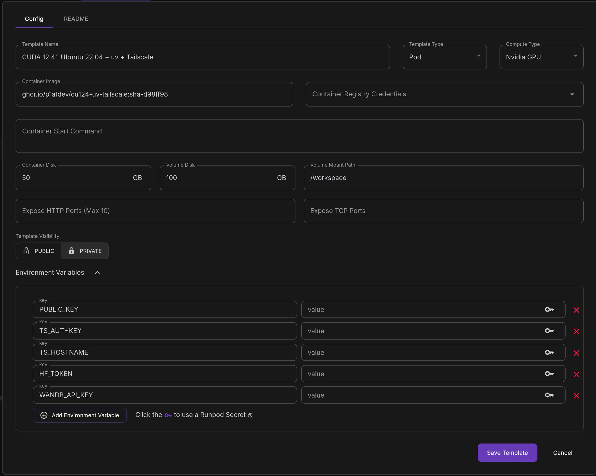

# CUDA 12.4.1 + uv + Tailscale docker image

- [nvidia/cuda:12.4.1-cudnn-devel-ubuntu22.04](https://hub.docker.com/layers/nvidia/cuda/12.4.1-cudnn-devel-ubuntu22.04/images/sha256-0a434eff1826693c1e2a669b20062f9995e73ed3456cdb70416d7ba9c1e3d1f5?context=explore)
- [uv](https://docs.astral.sh/uv/)
- [Tailscale](https://tailscale.com/)

## Docker compose

See [compose.yml](./compose.yml) for example.

Using ghcr.io:

```yaml
services:
  ghcr:
    image: ghcr.io/p1atdev/cu124-uv-tailscale:sha-d98ff98 # change tag as needed
    env_file:
      - .env
    volumes:
      - type: bind
        source: ./workspace
        target: /workspace
    deploy:
      resources:
        reservations:
          devices:
            - driver: nvidia
              count: 1
              capabilities: [gpu]
    restart: always
```

Building from source:

```yaml
services:
  local:
    build:
      context: .
      dockerfile: Dockerfile
    env_file:
      - .env
    volumes: # optional
      - type: bind
        source: ./workspace
        target: /workspace
    deploy:
      resources:
        reservations:
          devices:
            - driver: nvidia
              count: 1
              capabilities: [gpu]
    restart: always
```

Then run

```bash
docker compose up -d
```

## Runpod

Example:




## Env

```bash
PUBLIC_KEY=ssh-ed15529 ... # your ssh public key
TS_AUTHKEY=tskey-auth-... # your tailscale auth key
TS_HOSTNAME=cu124-uv # the hostname of node to use

HF_TOKEN=hf_... # your huggingface token
WANDB_API_KEY=12345... # your wandb api key
```